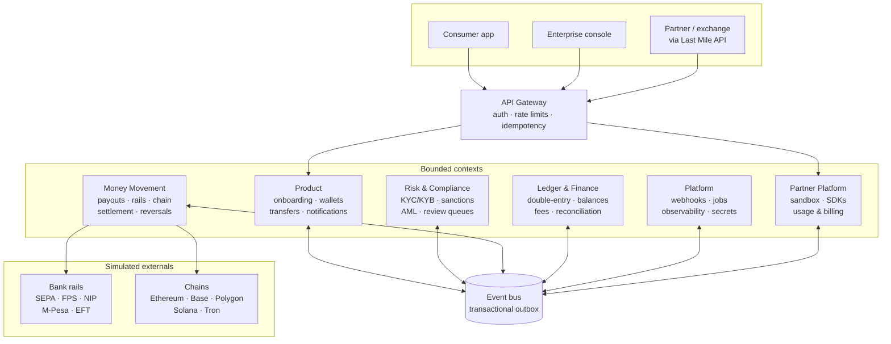
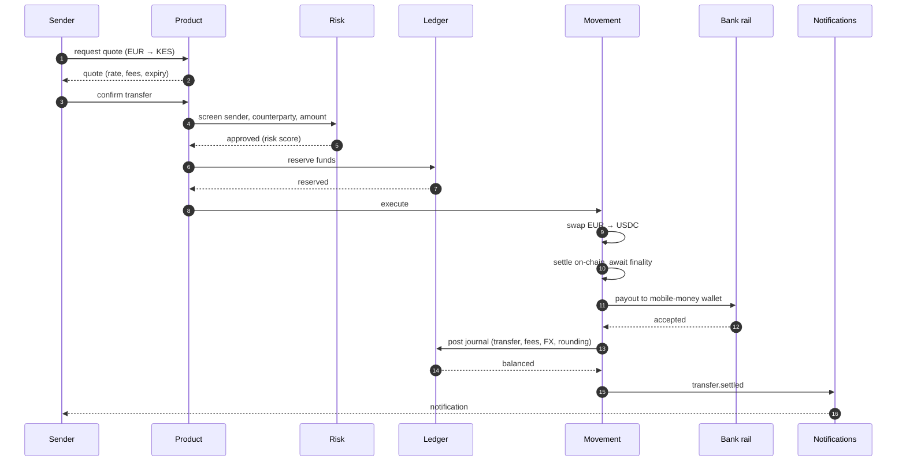

# Arc

[](https://github.com/el-uno/fintech_arc/actions/workflows/ci.yml)
[](https://nodejs.org)
[](tsconfig.base.json)
[](#licence)

**A simulation of cross-border stablecoin and fiat infrastructure for the EU↔Africa corridor.**

Arc models the backend of a payments business that moves money between Europe and Africa in seconds: multi-currency virtual accounts in, an instant swap to stablecoin, chain-agnostic settlement, and a local-rail payout out. It serves consumers and enterprises directly, and exposes the same rails to fintechs and exchanges through a white-label **Last Mile API**.

> [!IMPORTANT]
> **This is a simulation, not a financial system.** No real funds, no real bank connections, no real blockchain. Every external integration is a deterministic simulator. The sanctions list is synthetic — no real persons or entities appear in any data. Nothing here is investment, legal, or compliance advice. See [Non-goals](#non-goals).

---

## Status

Arc was built in ten phases, all complete. The plan they followed is in [`docs/BUILD_PLAN.md`](docs/BUILD_PLAN.md). What each phase deliberately left unbuilt is stated at the end of the page that describes it, rather than implied.

| Phase | Scope                                                                     | Status      |
| ----- | ------------------------------------------------------------------------- | ----------- |
| 0     | Workspace, money primitives, event bus + outbox, boundary enforcement, CI | ✅ Complete |
| 1     | Double-entry ledger, balances, invariant suite                            | ✅ Complete |
| 2     | Accounts and multi-currency virtual accounts                              | ✅ Complete |
| 3     | Chain-agnostic adapter + deterministic simulator                          | ✅ Complete |
| 4     | Money movement: rails, quotes, the settlement saga, reversals             | ✅ Complete |
| 5     | Risk & compliance: KYC/KYB, sanctions, AML, review queues                 | ✅ Complete |
| 6     | Platform: auth, gateway, webhooks, observability, secrets                 | ✅ Complete |
| 7     | Partner platform, sandbox, Last Mile API, SDKs                            | ✅ Complete |
| 8     | Reconciliation, reporting, runbooks                                       | ✅ Complete |
| 9     | Documentation consolidation — site canonical, drift enforced in CI        | ✅ Complete |

---

## The three flows

Everything Arc builds exists to serve these:

1. **Consumer remittance** — a Kenyan diaspora worker in Germany sends EUR; a KES mobile-money wallet receives it.
2. **Enterprise payout** — a Nigerian importer funds a virtual NGN account and pays an EU supplier's IBAN via SEPA Instant.
3. **Partner Last Mile** — an exchange embeds Arc's API to offer its own users EUR payouts without building bank integrations.

One set of rails, three surfaces.

---

## Architecture



Arc runs as a **modular monolith**: one deployable, six bounded contexts that never import each other's code. They communicate only through the event catalogue in `@arc/contracts` or by publishing on the bus. That boundary is enforced by `dependency-cruiser` in CI — a cross-context import **fails the build**, which is what keeps "modular monolith" a checked claim rather than a label.

### A corridor transfer, end to end



Every step has a **compensating action**, and this is now enforced: the chaos suite fails each of the five saga steps in turn and asserts the ledger is balanced in every currency, the sender's balance is exactly what it was, and every intermediate account is back to zero. See [settlement](https://arc-doc.mintlify.site/architecture/settlement-saga).

---

## Try it yourself

Five commands from a clean clone to watching a corridor transfer post its journals. Verified from an empty directory, not from a working tree.

```bash
git clone https://github.com/el-uno/fintech_arc.git && cd fintech_arc && pnpm install
```

```bash
docker compose -f ops/docker-compose.yml up -d
```

```bash
cp .env.example .env && pnpm prisma migrate deploy --schema prisma/schema.prisma
```

```bash
pnpm verify
```

```bash
pnpm dev
```

**Requires** Node 22+, pnpm 9, Docker. Nothing else — no cloud account, no API keys, no testnet faucet. Every external system is a deterministic simulator.

### What each command proves

| Command       | What you get                                                                                                                                                              |
| ------------- | ------------------------------------------------------------------------------------------------------------------------------------------------------------------------- |
| `pnpm verify` | The full gate: format, lint, typecheck, architecture boundaries, documentation integrity, and **387 tests** — 18 of which run against real Postgres                       |
| `pnpm dev`    | One EUR→KES transfer end to end: quote, compliance, reserve, swap, on-chain settlement, payout. Every journal printed entry by entry, then the trial balance per currency |

`pnpm dev` exits non-zero if any currency fails to balance, which is why CI runs it as a step rather than trusting the unit tests alone.

### Poke at it

Reading a passing suite proves less than breaking it. `pnpm test:watch`, then try breaking a journal by one cent, forcing a sandbox failure with a magic amount, removing the row locking, or `UPDATE`-ing a posted ledger entry in `psql`. Each one is refused by a different mechanism, and the site walks through all four.

**Full walkthrough:** [arc-doc.mintlify.site/start/quickstart](https://arc-doc.mintlify.site/start/quickstart)

---

## Why money is never a float

Every monetary value in Arc is an integer count of minor units held as a `bigint` — €100.00 is `10000n`, not `100.0`.

IEEE-754 doubles are binary fractions, so `0.1 + 0.2 === 0.30000000000000004`. Each error is ~1e-17: irrelevant for a temperature reading, fatal for a system whose central invariant is that debits equal credits _exactly_. The alternative is an epsilon tolerance on the balance check, at which point you no longer have a ledger — you have a ledger-shaped approximation, and "how far off is acceptable?" becomes unanswerable.

Doubles are also exact only to 2^53. That is fine for cents, but it is roughly 9 million USDC at 6 decimals and hopeless for an 18-decimal token, where a single balance routinely exceeds 1e18. For a chain-agnostic system, that alone settles it.

So: integer minor units, exact arithmetic, and rounding only where a policy is stated explicitly. Residuals are never discarded — a fraction of a cent lost in an FX conversion becomes its own ledger entry against a rounding account, so the journal still balances and the fraction stays auditable.

This is enforced, not merely intended. ESLint rejects `parseFloat`, `toFixed`, `Math.round/floor/ceil`, and fractional numeric literals in source:

```
error  Fractional number literal. Monetary values are bigint minor units       no-restricted-syntax
error  'Math.round' is restricted — use divRound() from @arc/money             no-restricted-properties
error  Unexpected use of 'parseFloat'. Floats cannot represent money exactly   no-restricted-globals
error  toFixed() formats a float. Use Money.toDecimalString()                  no-restricted-syntax
```

---

## What exists today

```
packages/
├── money/         Money, Rate, exact rounding — 94 tests, property-based
├── contracts/     Event catalogue and envelope — the seam between contexts
├── bus/           Event bus, outbox (in-memory + Postgres) — 14 tests
├── chain/         Chain-agnostic driver + deterministic simulator — 23 tests
├── db/            Prisma client and transaction helpers
└── sdk-node/      The partner SDK: signing, retries, webhook verification
apps/
├── api/           The Last Mile API — the composition root — 14 tests
└── scenario/      `pnpm dev` — a corridor transfer against Postgres
services/
├── ledger/        Double-entry engine, Postgres store, reconciliation — 76 tests
├── product/       Onboarding, tiers, virtual accounts — 24 tests
├── movement/      Rails, quotes, settlement saga — 42 tests
├── risk/          KYC/KYB, sanctions, AML rules, review queues — 47 tests
├── platform/      Auth, gateway, webhooks, secrets, tracing — 52 tests
└── partner/       Onboarding, sandbox, usage and billing
prisma/            Ledger tables with balance/append-only constraints, outbox
ops/               Postgres + Redis
docs/architecture/ledger.md   The ledger model, worked corridor example
docs/BUILD_PLAN.md            The full ten-phase plan
```

Two guarantees are already pinned by tests:

**Value is conserved under allocation.** Splitting any amount across any weights always sums back to exactly the original — the property that stops a cent appearing or vanishing when a transfer is broken into fees.

**Delivery is at-least-once, processing is effectively-once.** The outbox stages events in the same transaction as the state change. Handlers that already succeeded are never re-run on retry, and a poison event is parked for review rather than dropped or left blocking the queue.

**Balanced books are not the same as correct books.** Three-way reconciliation compares the ledger against bank statements and chain history; every break opens a case with an SLA. A currency can balance perfectly while Arc holds less than it owes — the float-position report is what notices. See [reconciliation](https://arc-doc.mintlify.site/architecture/reconciliation).

**A partner can integrate using only the SDK.** Sign up, get sandbox credentials, quote, and complete a EUR→KES payout — asserted end to end against the real router, saga and ledger. Sandbox failures are triggered by magic amounts, so the failure path is the same code production takes. See [partner platform](https://arc-doc.mintlify.site/architecture/partner-platform).

**It runs against a real database, and the invariants are tested there.** `pnpm dev` executes a full corridor transfer against Postgres and prints every journal. 18 integration tests exercise the constraint triggers, append-only enforcement, and concurrent posting — including two that prove row locking stops concurrent transfers double-spending the same balance.

**Requests are signed, idempotent and rate-limited.** A token says who you are; an HMAC signature says the body was not altered and is not a replay. Retrying a payout returns the original response — reusing a key with a different body is a conflict, not a cache hit. See [platform and security](https://arc-doc.mintlify.site/architecture/security).

**Compliance blocks money movement, it does not observe it.** A sanctions hit or a structuring pattern halts the transfer before a single journal is posted, opens a case with an SLA, and records a four-eyes audit trail. Asserted against the real saga, not a stub. See [compliance](https://arc-doc.mintlify.site/architecture/compliance).

**Chain settlement is deterministic and chain-agnostic.** Five chains with genuinely different behaviour — Polygon has 2s blocks but needs 128 confirmations, so it settles slowest despite looking fastest. A seeded run reproduces the same blocks, reorgs and transaction outcomes every time, and a reorg rolls a mined transaction back to pending before it is re-mined.

**Contexts never import each other.** Product publishes `virtual_account.issued`; the ledger subscribes and provisions the matching liability account. Enforced by two independent layers, because `dependency-cruiser` alone misses package-name imports.

**A journal cannot be unbalanced.** Enforced twice: the posting engine validates before writing anything, and the database refuses independently — a `DEFERRABLE INITIALLY DEFERRED` constraint trigger means a transaction leaving any journal unbalanced in any currency cannot commit, even from raw SQL. Entries are append-only; corrections are new reversing journals. See [the ledger](https://arc-doc.mintlify.site/architecture/ledger).

---

## Repository layout

The full target layout is in [`docs/BUILD_PLAN.md`](docs/BUILD_PLAN.md#3-repository-layout). In short: `packages/` holds shared primitives, `services/` holds the six contexts, `apps/` holds the deployables, `docs/` holds architecture, flows, ADRs, and runbooks.

---

## Non-goals

Stated plainly so this repo is never misread:

- **Not a real financial system.** Every external integration is a simulator.
- **Not production-hardened.** No HSM, no real KMS, no PCI scope, no regulatory licensing.
- **Not compliance software.** The AML rules and sanctions screening are illustrative of how such systems are structured — they are not a compliance program, and must not be used as one.
- **Not investment or financial advice.**

---

## Documentation

- [Build & execution plan](docs/BUILD_PLAN.md) — the ten phases, what each delivers, and what "done" means
- Architecture deep-dives, flow walkthroughs, ADRs, and runbooks land with the phases that produce them

## Licence

MIT
