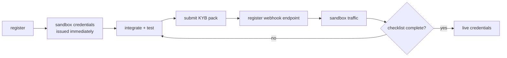

<span className="arc-eyebrow">Architecture · the platform</span>

The same rails Arc runs for its own customers, exposed to fintechs and exchanges.

The Phase 7 acceptance criterion: **a partner can sign up in the sandbox and complete a EUR→KES payout using only the published SDK.** That is asserted end to end in `apps/api/test/last-mile.test.ts` — the real router, the real saga, the real ledger, the real chain simulator.

---

## Onboarding



**Sandbox credentials are issued on registration, before any paperwork.** A partner should be able to integrate on day one; making them wait on KYB to see a single API response is how integrations stall.

Live access requires all of:

| Requirement                       | Why                            |
| --------------------------------- | ------------------------------ |
| Certificate of incorporation      | who they are                   |
| UBO declaration                   | who controls them              |
| Proof of address                  | where they are                 |
| Regulatory licence                | whether they may do this       |
| Signed agreement                  | terms                          |
| **A registered webhook endpoint** | they can receive async results |
| **Evidence of sandbox traffic**   | they have actually integrated  |

The last two are the ones usually skipped, and they are exactly the ones that predict a bad go-live. `goLive()` refuses while anything is outstanding and names what is missing.

Credentials are prefixed by environment — `ak_test_` / `sk_test_` versus `ak_live_` / `sk_live_` — so a key pasted into the wrong config is visibly wrong rather than quietly wrong.

---

## Sandbox

Isolated per partner, and **resettable**. Reset is the feature partners use most: integration means running the same scenario until it is right, and that only works if the slate is genuinely clean. Each reset bumps a generation counter, so a partner can prove which one they are on.

### Magic amounts

A partner cannot make Arc's rails fail on demand. The sandbox reads the **last two minor units of the send amount** as an instruction:

| Suffix        | Trigger                           |
| ------------- | --------------------------------- |
| `…61`         | blocked by compliance             |
| `…62`         | held for manual review            |
| `…63`         | sender cannot fund it             |
| `…66`         | rail rejects the beneficiary      |
| `…67`         | rail times out (retryable)        |
| `…68`         | settlement never reaches finality |
| `…69`         | a reorg rolls settlement back     |
| anything else | completes normally                |

So `€1000.66` always produces a rail rejection.

**Why not a `simulate: true` flag?** Because then the failure path runs through a code path production never takes, and the thing you tested is not the thing that ships. Magic amounts keep the request shape byte-identical to live.

Every triggered failure still compensates: the sandbox tests assert the ledger balances after a forced rail rejection, compliance block, and stuck settlement.

---

## The Last Mile API

Five routes, deliberately few:

| Route                        | Purpose                    |
| ---------------------------- | -------------------------- |
| `POST /v1/quotes`            | price a corridor transfer  |
| `POST /v1/transfers`         | execute against a quote    |
| `GET /v1/transfers/:id`      | read one back              |
| `POST /v1/webhook_endpoints` | register a signed callback |
| `POST /v1/sandbox/reset`     | wipe sandbox state         |

### Authentication

Every request carries `arc-client-id`, `arc-timestamp`, `arc-nonce` and `arc-signature`. The signature is HMAC-SHA256 over:

```
METHOD \n path \n timestamp \n nonce \n sha256(body)
```

**The nonce is not decoration.** Without it, two identical requests in the same millisecond produce the same signature, and the second is indistinguishable from a replay — which would reject a legitimate idempotent retry. This was found by writing the retry test, not by reasoning about it.

Three tests pin the auth path: an unknown client, a wrong secret, and a man-in-the-middle that rewrites the body but cannot re-sign it.

### Amounts on the wire

```json
{ "sendAmount": { "amount": "100000", "currency": "EUR" } }
```

An **integer string of minor units**, never a JSON number. Most clients parse a JSON number as a float, which would reintroduce precisely the error the ledger exists to prevent.

### Idempotency

`Idempotency-Key` on a transfer means a retry returns the original transfer instead of creating a second. The test asserts both the same id _and_ that usage metering recorded exactly one transfer — a weaker test would pass while double-charging.

---

## The SDK

`@arc/sdk` handles signing, nonces, retries and error typing.

`ArcApiError.retryable` is the field integrators need: a 429 or 5xx may succeed on retry, a 409 or 401 will not. Retrying a non-retryable error is how partners generate support tickets.

`verifyWebhookSignature` is **exported deliberately**, so integrators verify with the same code Arc signs with. The most common webhook integration bug is a receiver that "verifies" incorrectly and accepts anything.

---

## Billing

| Tier    | Platform fee | Included transfers | Per transfer | Volume | Rev-share |
| ------- | ------------ | ------------------ | ------------ | ------ | --------- |
| starter | €99.00       | 100                | €0.45        | 15bp   | —         |
| growth  | €499.00      | 2,000              | €0.28        | 10bp   | 1,000bp   |
| scale   | €2,500.00    | 25,000             | €0.14        | 6bp    | 2,500bp   |

Rev-share rebates a share of the corridor revenue Arc earned on that partner's traffic — it aligns the partner with volume rather than just charging for it.

**An invoice is money**, so it obeys the same rules as a transfer: integer minor units, exact arithmetic, and `invoiceJournalEntries` produces balanced ledger entries rather than leaving billing in a spreadsheet beside the ledger.

---

## What is not here yet

- **No HTTP server.** `createApi` returns a `handle(request)` function and the SDK talks to it through a `Transport` seam. Wiring Fastify around it is mechanical; nothing about the routing, auth or idempotency would change.
- **Generated OpenAPI.** The route shapes are hand-written here rather than emitted from the Zod schemas.
- **Partner state is in-memory.** Partners, credentials and usage records do not survive a restart, unlike the ledger and outbox.
- **Sandbox reset does not clear the ledger.** It clears quotes and transfers; ledger accounts persist.
- **No per-partner rate limit tiers.** One limiter configuration for everyone.
