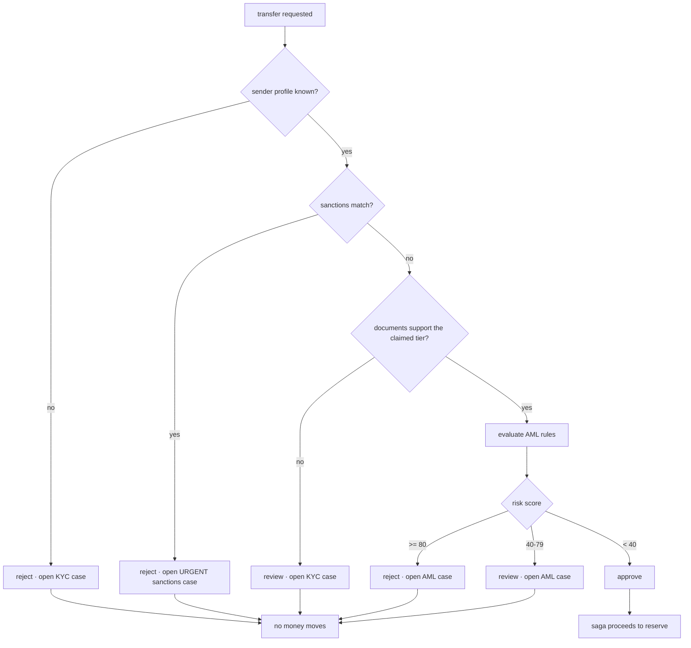
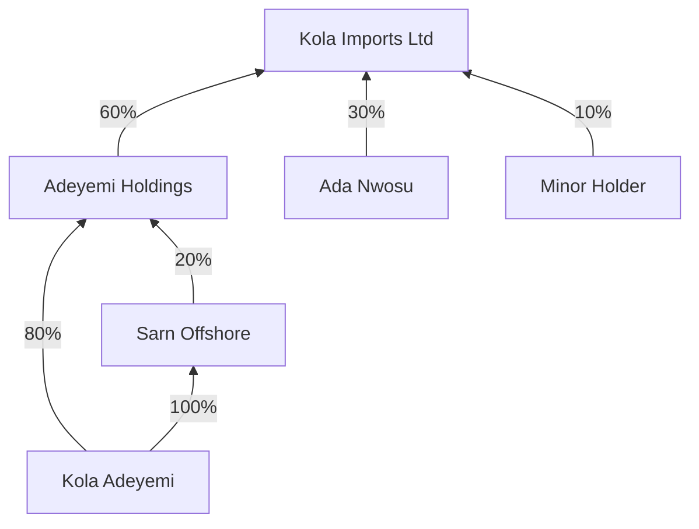

# Risk and compliance

> [!IMPORTANT]
> **This is illustrative, not a compliance program.** The sanctions list is synthetic — every name in it is invented, and none corresponds to any real person, entity, vessel, or sanctions programme. The rules, thresholds and scoring here show how such a system is _structured_; they are not calibrated for real use and must not be relied on for regulatory purposes.

Compliance is a **hard pre-condition on money movement**, not a side channel. A transfer that is rejected or flagged never reaches the ledger, so no money moves at all.

---

## The gate



**A sanctions hit is terminal.** It is never scored against other signals or netted off against a low amount — a €1.00 transfer from a matched name is blocked exactly as hard as a €100,000 one. Scoring it would imply a match could be outweighed, which is the wrong model.

---

## Sanctions screening

Fuzzy matching via **Jaro-Winkler**, with a token-aware pass so word order does not defeat a match.

| Input                    | Matches | Why                                       |
| ------------------------ | ------- | ----------------------------------------- |
| `Vorlan Krestomayer`     | ✓       | exact                                     |
| `Vorlan Krestomeyer`     | ✓       | one-character typo                        |
| `Krestomayer Vorlan`     | ✓       | token matching ignores order              |
| ` vórlan   krestomayer!` | ✓       | normalised for case, accents, punctuation |
| `BHZ Group`              | ✓       | alias                                     |
| `Amina Wanjiru`          | ✗       | unrelated                                 |

The **threshold is configurable and reported in the result** (default 0.90), alongside the list size and screening time. That combination is what makes a decision reproducible months later: you can show exactly what was screened, against what, at what tolerance.

False positives are a tuning problem, not a bug. A lower threshold catches more real matches and more noise; the tests pin both ends of that trade-off.

---

## KYC / KYB

Tiers are earned by documents, and the **granted** tier can be lower than the **requested** one:

| Tier | Requires                             |
| ---- | ------------------------------------ |
| 0    | —                                    |
| 1    | national ID                          |
| 2    | passport + proof of address + selfie |
| 3    | tier 2 + source of funds             |

Only `verified` documents count, and an **expired document is treated as missing** and reported separately — the distinction matters, because "you never gave us this" and "what you gave us lapsed" are different conversations with a customer.

KYB adds certificate of incorporation, UBO declaration, and proof of address.

### Beneficial ownership

Ownership is resolved through chains of holding companies, multiplying percentages down each path and **summing where a person owns through several**:



Kola Adeyemi's effective ownership is **60%**: 80% × 60% = 48% directly through the holding company, plus 100% × 20% × 60% = 12% through the offshore vehicle. Neither path alone crosses a 25% disclosure threshold on its own reading, but together they clearly do — which is exactly the structure that layered ownership is used to obscure.

Percentages are held in **basis points as integers**, so the multiplication stays exact. Circular ownership terminates via a visited set.

---

## The AML rule engine

Five rule families, each returning a hit with a severity, a score, a human-readable reason, and **evidence** — the transfer ids that triggered it.

| Rule                         | Severity | Fires when                                                               |
| ---------------------------- | -------- | ------------------------------------------------------------------------ |
| `structuring`                | high     | 3+ transfers within 15% below the €10,000 reporting threshold, in 7 days |
| `round_tripping`             | high     | funds returning to a counterparty that recently sent to this account     |
| `velocity`                   | medium   | more than 8 transfers, or over €25,000, in 24h                           |
| `counterparty_concentration` | medium   | 80%+ of 30-day volume to one beneficiary                                 |
| `unusual_corridor`           | low      | first transfer on a corridor, once a baseline of 3 exists                |

### Scoring

The highest single hit dominates; every additional hit contributes a **quarter** of its score. Several weak signals cannot outweigh one strong one — a first-time corridor plus mild velocity should not reach the same conclusion as a structuring pattern.

Both high-severity rules are calibrated to clear the reject threshold at their **minimum** trigger count: three structured transfers score 84, round-tripping scores 80, and the threshold is 80. That is deliberate — a rule labelled "high severity" that only produces a review is mislabelled.

The whole calculation runs in integer arithmetic, scaled by four and truncated once at the end.

---

## Review queues

| Queue            | Four eyes? | Typical priority  |
| ---------------- | ---------- | ----------------- |
| `sanctions`      | **yes**    | urgent            |
| `aml`            | **yes**    | scales with score |
| `kyc`            | no         | normal            |
| `reconciliation` | no         | varies            |

SLAs come from priority: urgent 1h, high 4h, normal 24h, low 72h. `breachedSla()` returns overdue cases oldest first.

### Four-eyes approval

On `sanctions` and `aml`, the first decision only **stages** an outcome — the case moves to `awaiting_second_approval` and stays open. A second, _different_ approver is required to close it, and the same person attempting both is rejected explicitly:

```
RiskError: analyst_a already approved case …; a second, different approver is required
```

Escalation is the exception: it closes immediately, because escalating is a hand-off rather than a decision.

### The audit trail

Every case carries an append-only audit log. A worked sanctions case reads:

```
system:opened
analyst_a:assigned
analyst_a:decided:rejected      (note: "confirmed true positive")
supervisor_b:decided:rejected
```

Who, what, when, and why — reconstructible without reading application logs.

---

## What the tests prove

The Phase 5 acceptance criterion was that a structuring pattern and a sanctions hit each block a transfer and open a case with a complete audit trail. Both are asserted **against the real saga**, not against a stub:

| Scenario             | Asserted                                                                                                                 |
| -------------------- | ------------------------------------------------------------------------------------------------------------------------ |
| Clean transfer       | completes; no case opened                                                                                                |
| Sanctions hit        | `failedStep: compliance`, zero steps completed, sender balance unchanged, ledger balanced, urgent case citing `SYN-0001` |
| Structuring pattern  | rejected before `reserve`, AML case with score ≥ 80 and the threshold cited in its reasons                               |
| Unknown sender       | rejected, KYC case opened                                                                                                |
| Case worked to close | four-eyes enforced, same-approver rejected, full audit sequence                                                          |

The compliance service and the saga are wired together at the composition root: `ScreeningService` **structurally satisfies** movement's `CompliancePort` without either context importing the other.

---

## What is not here yet

- **Periodic re-verification.** Documents expire and are reported, but nothing schedules a re-KYC.
- **Ongoing monitoring.** Rules run pre-transaction; the plan's post-transaction batch review is not built.
- **Case assignment policy.** Assignment is manual; no round-robin, workload balancing or skill routing.
- **Screening cache.** Every transfer re-screens from scratch — fine at simulation scale, wrong at real volume.
- **PEP and adverse-media screening.** Only the synthetic sanctions list is checked.
