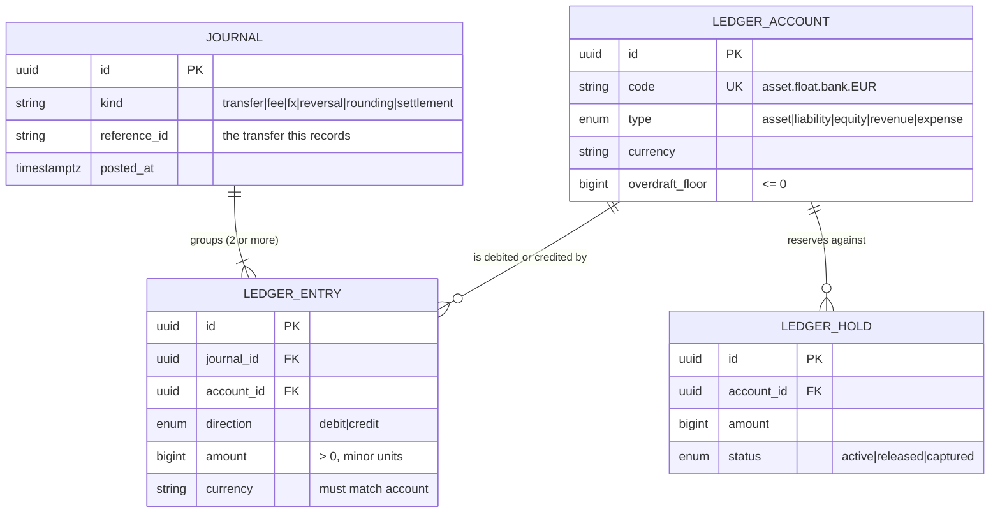
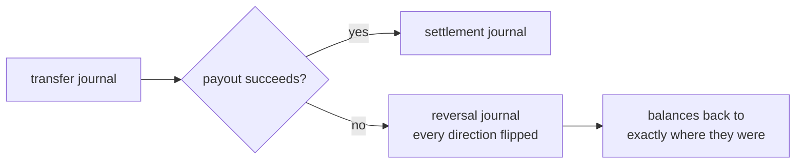
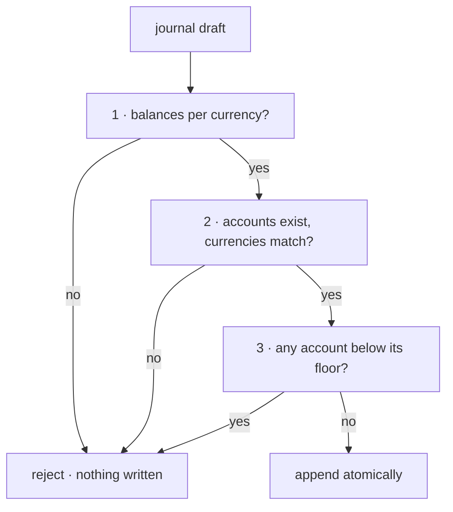

# The ledger

Everything else in Arc is an interface onto this. Transfers, fees, FX, reversals, reconciliation and reporting are all ways of asking the ledger a question or telling it something happened.

The ledger has one job: **record what happened to money, exactly, and never lose a unit of it.**

---

## The model



Three ideas carry the whole design.

**A customer's balance is a liability.** When someone funds a virtual account, Arc gains an asset — float sitting at a bank or on-chain — and simultaneously owes that person the same amount. Those are the two sides of one journal. Keeping them paired is what makes _"do we actually hold what we owe?"_ an answerable question rather than a hope.

**Balances are derived, never stored.** A balance is a fold over entries. Replaying the entry log from the beginning must reproduce the same figures; if it does not, the entries are right and the cached number is wrong.

**Entries are append-only.** A correction is a new, opposing journal — never an edit, never a delete. The record of what happened stays separate from the record of what was meant to happen, which is the property an auditor actually cares about.

---

## Account types and direction

Debits increase assets and expenses. Credits increase liabilities, equity and revenue.

| Type        | Increases on | Example                                                  |
| ----------- | ------------ | -------------------------------------------------------- |
| `asset`     | debit        | `asset.float.bank.EUR` — fiat held at a partner bank     |
| `liability` | credit       | `liability.customer.va_1.EUR` — what Arc owes a customer |
| `equity`    | credit       | `equity.fx_position.EUR` — the FX bridge                 |
| `revenue`   | credit       | `revenue.fee.corridor.EUR`                               |
| `expense`   | debit        | `expense.network_fee.USDC`                               |

The same entry moves two accounts in opposite senses. A €10 debit _raises_ a bank-float asset and _lowers_ a customer liability. That mapping lives in exactly one place — `NORMAL_BALANCE` in [`accounts.ts`](../../services/ledger/src/accounts.ts) — and `entrySign()` is the only thing that reads it.

---

## The central invariant

> In every currency it touches, a journal's debits equal its credits. Exactly.

Not within a tolerance. This is the reason money is an integer count of minor units: with floats an epsilon would be unavoidable here, and _a ledger with an epsilon is not a ledger_ — "how far off is acceptable?" has no defensible answer, and the drift grows with volume.

**Per currency, independently.** A journal that converts EUR to USDC has two halves and each must close on its own. Offsetting a EUR debit against a USDC credit would be adding quantities of different things. The FX position accounts are what close each half — and the pair of them is where an unhedged exposure becomes visible.

---

## Worked example: €1,000.00 from Germany to a Kenyan mobile-money wallet

Three journals. Every one balances in every currency it touches.

### 1. The sender commits — `kind: transfer`

| Account                            | Dr          | Cr          |
| ---------------------------------- | ----------- | ----------- |
| `liability.customer.va_sender.EUR` | 1000.00     |             |
| `liability.in_transit.EUR`         |             | 990.00      |
| `revenue.fee.corridor.EUR`         |             | 5.00        |
| `revenue.fee.fx_spread.EUR`        |             | 5.00        |
| **EUR totals**                     | **1000.00** | **1000.00** |

The customer's liability falls by €1,000 (Arc owes them less). €990 moves into in-transit; €10 becomes revenue.

### 2. Convert to KES — `kind: fx`

| Account                    | Dr             | Cr             |
| -------------------------- | -------------- | -------------- |
| `liability.in_transit.EUR` | 990.00         |                |
| `equity.fx_position.EUR`   |                | 990.00         |
| `equity.fx_position.KES`   | 138,401.00     |                |
| `asset.float.bank.KES`     |                | 138,401.00     |
| **EUR totals**             | **990.00**     | **990.00**     |
| **KES totals**             | **138,401.00** | **138,401.00** |

Two currencies, two independent balances. Neither half references the other; the position accounts are the bridge.

### 3. Pay out — `kind: settlement`

| Account                               | Dr             | Cr             |
| ------------------------------------- | -------------- | -------------- |
| `asset.float.bank.KES`                | 138,401.00     |                |
| `liability.customer.va_recipient.KES` |                | 138,401.00     |
| **KES totals**                        | **138,401.00** | **138,401.00** |

**Afterwards:** the sender's balance is zero, the recipient holds KES 138,401.00, Arc kept €10.00 in revenue, and the trial balance is zero in every currency. That exact sequence is asserted in [`posting.test.ts`](../../services/ledger/test/posting.test.ts).

---

## Rounding residuals

A 1.5% fee on €33.33 is €0.49995 — not representable in cents. Round it to €0.49 and €0.00995 has to go _somewhere_, or the journal will not balance.

Arc posts it:

| Account                       | Dr    | Cr    |
| ----------------------------- | ----- | ----- |
| `liability.customer.va_1.EUR` | 33.33 |       |
| `liability.in_transit.EUR`    |       | 32.83 |
| `revenue.fee.corridor.EUR`    |       | 0.49  |
| `revenue.rounding.EUR`        |       | 0.01  |

The residual becomes a number someone can look at, rather than drift nobody can explain. `divResidual()` in `@arc/money` returns the exact leftover from any rounded division precisely so it can be posted like this.

---

## Reversal

Arc undoes things by posting the opposite journal, never by deleting.

If a journal balances, its reversal balances too — flipping every direction preserves the equality. That makes unwinding a failed transfer safe _by construction_ rather than by careful coding, which matters because the unwind path is the one that runs when something has already gone wrong.



`reverseEntries()` is an involution: reversing twice returns the original. Both properties are covered by the property suite.

---

## Balance-or-reject

`PostingEngine.post()` validates in full before writing anything. A rejection leaves no trace — there is no path that writes some entries and then discovers a problem.



Cheapest and most fundamental check first: balance is pure and needs no I/O, so a malformed journal never reaches the database at all.

### Available vs posted

```
posted    = fold over all entries, signed by the account's normal balance
reserved  = sum of active holds
available = posted − reserved
```

Holds are how funds get committed to an in-flight transfer without being spent. A quote reserves; execution captures; expiry releases.

---

## Enforced twice, on purpose

The posting engine refuses to write an unbalanced journal. The **database refuses too**, independently.

This is deliberate duplication. An invariant that depends on every future developer remembering to go through the right class is not an invariant — it is a convention, and conventions erode. The rules in [`20260811234700_ledger_invariants/migration.sql`](../../prisma/migrations/20260811234700_ledger_invariants/migration.sql) hold against raw SQL, a migration script, or a psql session at 3am during an incident:

| Rule                               | Mechanism                                            |
| ---------------------------------- | ---------------------------------------------------- |
| Journals balance per currency      | `CONSTRAINT TRIGGER … DEFERRABLE INITIALLY DEFERRED` |
| At least two entries per journal   | same trigger                                         |
| Amounts are positive               | `CHECK (amount > 0)`                                 |
| Entry currency matches its account | composite `FOREIGN KEY (account_id, currency)`       |
| Overdraft floors are non-positive  | `CHECK (overdraft_floor <= 0)`                       |
| Entries are append-only            | `BEFORE UPDATE OR DELETE` trigger                    |

`DEFERRABLE INITIALLY DEFERRED` is what makes the balance check workable: it runs at `COMMIT`, not per row, so a journal can be inserted one entry at a time and is judged only once complete. A transaction that leaves any journal unbalanced in any currency **cannot commit**.

Verified against a live database — each of these was attempted through raw SQL and rejected:

```
ERROR:  journal aaaa…0002 does not balance in EUR: debits 100000 vs credits 99999 (difference 1)
ERROR:  journal aaaa…0003 does not balance in EUR: debits 5000 vs credits 0 (difference 5000)
ERROR:  new row violates check constraint "ledger_entry_amount_positive"
ERROR:  violates foreign key "ledger_entry_account_currency_fkey" … (account, KES) not present
ERROR:  ledger_entry is append-only: post a reversing journal instead of UPDATE on entry e000…0001
ERROR:  ledger_entry is append-only: post a reversing journal instead of DELETE on entry e000…0001
```

---

## What the tests actually prove

The suite is property-based where it matters, because example tests only cover the cases someone thought of.

| Property                 | Assertion                                                                          |
| ------------------------ | ---------------------------------------------------------------------------------- |
| Balance is unforgiving   | Any balanced journal perturbed by **one minor unit** anywhere is rejected          |
| Completeness             | Any journal missing any entry is rejected                                          |
| Solvency under load      | After any random sequence of journals, the trial balance is zero in every currency |
| Rejection is total       | A rejected journal changes nothing — entry count is identical before and after     |
| Reversal is exact        | A journal and its reversal return every touched balance to precisely where it was  |
| Balances are a pure fold | Recomputing from the log — in any order — gives the same answer                    |

**These tests were mutation-checked.** Three deliberate defects were introduced to confirm the suite is load-bearing rather than decorative:

| Mutation                                 | Result         |
| ---------------------------------------- | -------------- |
| Balance validation removed from `post()` | 3 tests failed |
| Overdraft floor off by one minor unit    | 1 test failed  |
| `entrySign()` ignores account type       | 9 tests failed |

A suite that passes when the code is broken proves nothing. These do not.

---

## What is not here yet

- **The Prisma-backed store.** The engine runs against `InMemoryLedgerStore`; the schema, constraints and triggers are live and verified, but the adapter that connects them arrives with Phase 2, when there are real accounts to persist.
- **Holds are modelled, not yet wired.** The table and the `available = posted − reserved` projection exist; quote-time reservation belongs to Phase 4.
- **Reconciliation and reporting** are Phase 8.
