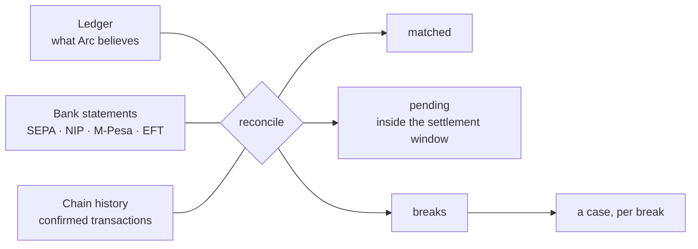

# Reconciliation and reporting

The ledger balancing proves Arc's books are **internally consistent**. It says nothing about whether they match reality.

A payout the ledger records but the bank never made leaves the ledger perfectly balanced and the money missing. Reconciliation is the control that catches that class of error — and it is a different question from every invariant enforced so far.

---

## Three-way



Each external source is reconciled **independently**. A bank record and a chain record for the same transfer are different facts about different legs; matching them against one another would compare a fiat payout to a stablecoin settlement.

### Break kinds

| Kind                 | Severity | Means                                                         |
| -------------------- | -------- | ------------------------------------------------------------- |
| `missing_external`   | high     | the ledger records it, the rail never reported it             |
| `missing_internal`   | high     | the rail moved money with no ledger entry                     |
| `amount_mismatch`    | high     | both agree it happened, they disagree on how much             |
| `duplicate_external` | medium   | two external records for one journal — a double payout        |
| `currency_mismatch`  | high     | should be impossible; the DB has a composite FK preventing it |

### The settlement window

Rails settle asynchronously. Without a grace period every reconciliation run would raise a break for every in-flight transfer, and a report that is mostly noise gets ignored — which is worse than no report.

Records younger than the window are counted `pending`, not broken. Past it, silence becomes a break.

---

## Breaks become cases

Every break opens a case in the `reconciliation` queue, with severity mapped to priority and SLA:

| Severity | Priority | SLA      |
| -------- | -------- | -------- |
| high     | urgent   | 1 hour   |
| medium   | high     | 4 hours  |
| low      | normal   | 24 hours |

A break nobody is assigned to is a break nobody resolves, and **an unexplained difference is indistinguishable from fraud**.

The ledger does not import the risk context. `CaseOpener` is an interface the ledger declares and the composition root satisfies with the real `ReviewQueue` — the same port pattern used everywhere else.

---

## Reporting

### Trial balance

Debits equal credits, per currency. Proves internal consistency. Already enforced at post time and by the database.

### Float position — _do we hold what we owe?_

```
assets − liabilities = surplus
covered = surplus >= 0
```

**This is a different question from the trial balance, and that difference is the point.** A currency can balance perfectly while assets sit short of liabilities, because equity absorbs the gap. A test asserts exactly that: after a loss that drains float, the trial balance is still zero in every currency and `covered` is `false`.

If you only ever check the trial balance, you will not notice becoming uncovered.

### P&L

Per currency, **never summed across currencies**. Converting at a reporting rate would bake today's FX into a historical figure and make last month's profit move for reasons that have nothing to do with last month.

### Statements

An account statement with a running balance, ordered by posting time, so an auditor or a partner can follow the arithmetic line by line rather than being handed a total to trust.

### Corridor summary

Volume, gross revenue, direct expenses, and net per corridor. Journals carry a `referenceId`, not a corridor, so the caller supplies the mapping — tagging every journal with a corridor would push a product concept into the ledger, whose job is to record what happened rather than why.

---

## Runbooks

Written as if on call, with the diagnosis before the fix:

- [Reconciliation break](../runbooks/reconciliation-break.md) — triage by break kind, three resolutions, closing criteria
- [Stuck settlement](../runbooks/stuck-settlement.md) — mempool, reverts, finality depths per chain
- [Chain reorg](../runbooks/chain-reorg.md) — expected depths, and the one question that matters

Every resolution is **a new journal**. The database refuses edits and deletes (`ledger_entry is append-only`), and that refusal is the design, not an obstacle.

The reconciliation runbook explicitly forbids posting a difference to suspense and moving on. Suspense balances are where breaks go to be forgotten.

---

## What the tests prove

The Phase 8 criterion was that an injected break is detected, cased, and resolvable by following the runbook alone. One test executes precisely that:

1. A real payout is posted; the trial balance is zero and nothing looks wrong.
2. The bank statement arrives with no record of it.
3. Reconciliation raises `missing_external` with a €400.00 difference.
4. A case opens: urgent, 1-hour SLA, audit trail.
5. **Runbook Resolution A** is applied — a reversing journal, no edit to anything.
6. Re-reconciliation is clean; trial balance zero _and_ float covered.
7. The case closes citing the correcting journal id.
8. The original settlement journal is still in the record — the history shows what happened _and_ what corrected it.

Mutation-checked:

| Mutation                           | Tests failed |
| ---------------------------------- | ------------ |
| Settlement window ignored          | 1            |
| Amount comparison always matches   | 2            |
| Float position ignores liabilities | 2            |

---

## What is not here yet

- **No scheduled runs.** Reconciliation is a function, not a job. Wiring it to the queue infrastructure is Phase 9 work.
- **External feeds are supplied by the caller.** Nothing parses a real SEPA or M-Pesa statement format.
- **No break auto-resolution.** Every break needs a human, which is correct today and would not scale.
- **Corridor mapping is caller-supplied**, so corridor P&L depends on the caller getting it right.
