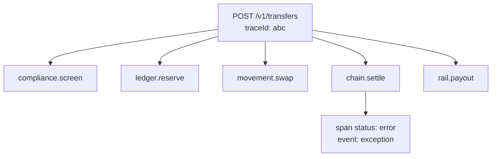

# Platform and security

Auth, the API gateway, webhook delivery, secrets, and observability — the machinery every other context relies on.

---

## Authentication

Two mechanisms, doing two different jobs:

| Mechanism                     | Answers                                        |
| ----------------------------- | ---------------------------------------------- |
| **OAuth2 client credentials** | _Who is calling?_                              |
| **HMAC request signing**      | _Was this exact request altered, or replayed?_ |

A token alone is not enough for money movement. If a token leaks, it can be used to send whatever the attacker likes; a signature binds the request to its body, path and moment in time.

### Tokens

Scoped and expiring. A client can **never** receive a scope it was not granted — asking for `admin` when you hold `quotes:read` is an error, not a silently narrowed token. Revoking a client invalidates its live tokens immediately rather than waiting for expiry.

### Signatures

The canonical string is `METHOD\npath\ntimestamp\nsha256(body)`. Verification checks, in order:

1. **Timestamp drift** — outside ±5 minutes is refused _before_ anything else, so an old request cannot consume replay-cache space.
2. **Signature match** — constant-time comparison, so a wrong signature leaks no timing information about how wrong.
3. **Replay** — a signature already used is refused.

Tampering with the body, the path, or the client all fail. Each of these has a test.

---

## Gateway

### Idempotency

A partner retrying a payout must get the **original response**, not a second payout.

| Situation                         | Behaviour                                   |
| --------------------------------- | ------------------------------------------- |
| Same key, same body               | Cached response replayed; handler runs once |
| Same key, **different** body      | `409 idempotency_conflict`                  |
| Same key, request still in flight | `409 in_progress`                           |
| Handler threw                     | Key released — a failure must be retryable  |
| Different tenant, same key        | Independent; keys are tenant-scoped         |

The conflict case matters most. Silently returning the first response would hide a client bug behind a success, and the client would never learn that its second, different request never happened.

### Rate limiting

Token bucket per tenant: a sustained refill rate plus a burst allowance. Denials carry `retryAfterMs`, rounded **up** so a client never retries a millisecond too early.

---

## Webhooks

Delivery is at-least-once with signed payloads.

```
arc-signature: t=1780000000000,v1=<hmac-sha256 of "timestamp.body">
arc-event-id:  evt_…
arc-delivery-id: dlv_…
arc-attempt:   3
```

`verifySignature` is **exported for receivers to use** — partners verify with exactly the function that signs, rather than reimplementing it from prose and getting the concatenation order subtly wrong.

Receiver-side verification enforces a timestamp window, so a captured payload cannot be replayed forever, and compares in constant time.

| Property        | Behaviour                                                             |
| --------------- | --------------------------------------------------------------------- |
| Transport       | https only; http endpoints are refused at registration                |
| Retries         | Exponential backoff, 6 attempts, then `exhausted`                     |
| Failures        | Both non-2xx responses and transport exceptions are recorded attempts |
| Replay          | Any delivery can be re-sent on request, including a delivered one     |
| Secret rotation | New secret takes effect immediately; old signatures stop verifying    |
| Isolation       | Events never cross tenants, and disabled endpoints are skipped        |

---

## Secrets

**Envelope encryption.** Each secret gets its own AES-256-GCM data key; the data key is encrypted under a master key.

Two consequences:

- Rotating the master key **rewraps data keys** rather than re-encrypting every secret.
- A leaked data key exposes exactly one secret, not the whole store.

Identical plaintexts produce different ciphertexts, so nothing leaks between secrets by comparison. GCM's auth tag means tampering is detected on open, not silently decrypted into garbage. Old master-key versions are retained so secrets sealed before a rotation stay readable.

### Redaction

Applied by **key name** (`client_secret`, `authorization`, `api_key`, `private_key`, `iban`, `pan`, …) and by **value pattern** (IBANs, `whsec_…`, `Bearer …`, card-length digit runs).

Both are needed: a token is caught whether it sits under a known key or is embedded in free text like `"header was Bearer abc…"`. Every span attribute and log field passes through it, so redaction is a property of the logging path rather than a discipline each caller must remember.

---

## Observability

A corridor transfer crosses five contexts. One trace id threading all of them is the difference between _"the transfer failed"_ and _"the payout rail timed out after the chain reached finality"_.



`inSpan` ends the span correctly on both paths and records an `exception` event with an errored status before rethrowing — a failed span is never left open.

Metrics are RED — rate, errors, duration — with labelled counters and percentile histograms.

---

## What the mutation tests proved

Security code that passes its tests while being broken is worse than no tests. Four deliberate defects:

| Mutation                                     | Tests failed |
| -------------------------------------------- | ------------ |
| Signature comparison always returns true     | 4            |
| Replay-cache check removed                   | 1            |
| Idempotency body-hash conflict check removed | 1            |
| Webhook timestamp tolerance ignored          | 1            |

---

## What is not here yet

- **Real transport.** `WebhookTransport` is an interface; nothing makes an HTTP call.
- **Persistence.** Tokens, idempotency records, deliveries and secrets are in-memory. The Prisma `idempotency_key` table exists from Phase 0 but is not yet wired.
- **A real KMS.** The master key is a process-local buffer. Real deployments use an HSM or cloud KMS; the envelope structure is what would carry over.
- **mTLS.** Mentioned in the plan, not built.
- **Distributed rate limiting.** The token bucket is per-process; multiple instances would need Redis.
