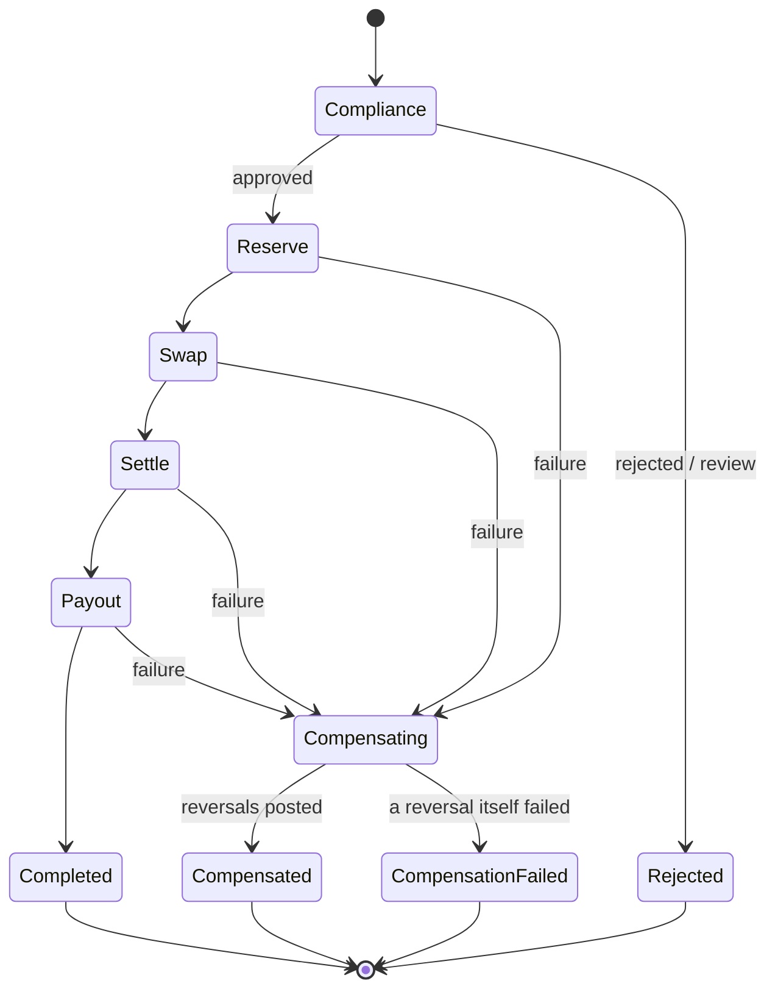

# Settlement

How money actually crosses the corridor: quote, screen, reserve, swap, settle on-chain, pay out — with a compensating action at every step.

The claim this document exists to justify:

> **For every failure at every step of the saga, the ledger ends balanced and the sender is made whole.**

That is asserted by the chaos suite, and the suite is mutation-checked.

---

## The saga



Five steps, each with an `execute` and a `compensate`. On failure the saga walks the **completed** steps backwards and compensates each.

| Step         | Does                                                           | Compensates by                               |
| ------------ | -------------------------------------------------------------- | -------------------------------------------- |
| `compliance` | Screens sender, beneficiary, amount, corridor                  | Nothing — no money has moved                 |
| `reserve`    | Debits the sender; splits out fees                             | Reversing journal: sender refunded in full   |
| `swap`       | Converts the send currency to the settlement asset             | Reversing journal                            |
| `settle`     | Broadcasts on-chain, waits for finality, posts the network fee | Reversing journal                            |
| `payout`     | Submits to the local rail                                      | Recalls the payout, then a reversing journal |

**Compliance is a hard pre-condition, not a side channel.** A transfer that is rejected or flagged for review never reaches `reserve`, so no money moves at all. Phase 5 replaces the permissive default with the real rule engine; the gate is already wired.

---

## The accounting, step by step

€1,000.00 from Germany to a Kenyan mobile-money wallet, settling via USDC on Base.

### 1. `reserve` — take the money and the fees

| Account                            | Dr      | Cr     |
| ---------------------------------- | ------- | ------ |
| `liability.customer.va_sender.EUR` | 1000.00 |        |
| `liability.in_transit.EUR`         |         | 989.09 |
| `revenue.fee.corridor.EUR`         |         | 4.85   |
| `revenue.fee.fx_spread.EUR`        |         | 6.06   |

The sender's liability falls; the net moves into in-transit; the rest becomes revenue.

### 2. `swap` — EUR obligation becomes a USDC asset

| Account                    | Dr      | Cr      |
| -------------------------- | ------- | ------- |
| `liability.in_transit.EUR` | 989.09  |         |
| `equity.fx_position.EUR`   |         | 989.09  |
| `asset.float.chain.USDC`   | 1072.35 |         |
| `equity.fx_position.USDC`  |         | 1072.35 |

Two currencies, each balancing independently. The EUR position account now carries a standing credit — that _is_ the open FX exposure, and it is visible rather than implicit.

### 3. `settle` — USDC leaves, KES arrives

| Account                     | Dr         | Cr         |
| --------------------------- | ---------- | ---------- |
| `equity.fx_position.USDC`   | 1072.35    |            |
| `asset.float.chain.USDC`    |            | 1072.35    |
| `asset.float.bank.KES`      | 139,121.37 |            |
| `liability.in_transit.KES`  |            | 138,286.64 |
| `revenue.fee.fx_spread.KES` |            | 834.73     |

**The partner settles at mid-market; the customer is paid at the quoted rate.** The difference is Arc's FX margin, and this is the only point in the flow where it becomes real, so it is recognised as revenue here.

Leaving it unbooked was a real defect, found by running the scenario against a live database and querying the revenue accounts: `revenue.fee.fx_spread` had **no entries at all**. The quote itemised a spread, the customer paid it, and the margin sat invisibly inside the FX position accounts. The ledger balanced the whole time — balance cannot detect unrecognised revenue.

Plus a separate journal for the gas actually spent:

| Account                   | Dr        | Cr        |
| ------------------------- | --------- | --------- |
| `expense.network_fee.ETH` | 0.000018… |           |
| `asset.float.chain.ETH`   |           | 0.000018… |

Arc now holds KES float and owes KES to the beneficiary.

### 4. `payout` — discharge the obligation

| Account                    | Dr         | Cr         |
| -------------------------- | ---------- | ---------- |
| `liability.in_transit.KES` | 138,254.00 |            |
| `asset.float.bank.KES`     |            | 138,254.00 |

Float down, obligation gone. Every currency balanced at every step.

---

## Why compensation is safe by construction

A compensation is the **reverse of the exact journal that step posted** — every direction flipped, same accounts, same amounts. Two properties follow:

1. **If the original balanced, the reversal balances.** Flipping directions preserves the equality, so a compensation can never itself unbalance the ledger.
2. **The pair nets to zero.** Every touched account returns to precisely where it was.

This matters because the compensation path runs when something has _already_ gone wrong. It must not depend on getting fresh logic right under failure — it depends only on arithmetic that was already true.

### Order matters, and is asserted

Compensation walks completed steps **backwards**: payout, then settle, then swap, then reserve.

For the ledger alone, order is irrelevant — reversals commute, because addition commutes. But order is not irrelevant overall:

- The rail recall must happen before the settlement is unwound.
- Each reversal journal must _describe the step it actually undoes_. Compensating forward would produce a journal labelled "refund sender" that reverses the payout entries — a balanced ledger with a false audit trail.

The suite asserts reversal order and account pairing directly, precisely because the balance check alone cannot catch it. That gap was found by mutation testing, not by inspection.

---

## Failure modes

### Injected, at every step

The chaos suite fails each of the five steps in turn and asserts:

- status is `compensated`
- the ledger is balanced in every currency
- the sender's balance is **exactly** what it was before
- every intermediate account — in-transit, corridor fee, FX spread — is back to zero

### Real, not just injected

| Failure                                                             | Behaviour                                             |
| ------------------------------------------------------------------- | ----------------------------------------------------- |
| Chain never reaches finality                                        | `settle` fails; swap and reserve unwind               |
| Rail rejects (account closed, invalid beneficiary, compliance hold) | `payout` fails; everything unwinds                    |
| Rail times out                                                      | Marked **retryable**; a rejection is not              |
| Sender cannot fund the transfer                                     | `reserve` fails on the overdraft floor; nothing moves |
| Compliance rejects or flags for review                              | Halts before `reserve`                                |

---

## Rails

Six simulated rails with genuinely different behaviour:

| Rail              | Currency | Instant | Cut-off (UTC) | Notes                     |
| ----------------- | -------- | ------- | ------------- | ------------------------- |
| `sepa_instant`    | EUR      | yes     | —             | €100k cap                 |
| `sepa_credit`     | EUR      | no      | 15:00         | misses cut-off → next day |
| `faster_payments` | GBP      | yes     | —             |                           |
| `nip`             | NGN      | yes     | —             | highest reject rate       |
| `mpesa`           | KES      | yes     | —             | highest timeout rate      |
| `eft`             | ZAR      | no      | 14:00         | T+2                       |

Missing a cut-off by six hours costs a full day — the queued payment starts from the _next opening_ and then takes the rail's normal latency. That is asserted, not assumed.

Rails are idempotent on the caller's key: resubmitting returns the original receipt rather than paying twice.

---

## Quotes

```
corridor fee   = 45bp of send + €0.35 fixed
net            = send − corridor fee − network fee
quoted rate    = mid-market − 60bp spread
receive        = net × quoted rate
fx spread fee  = (net × mid) − (net × quoted)
```

Every figure is exact integer arithmetic on minor units. The spread is recorded as its own fee line and its own ledger entry — it is revenue, and burying it in the rate would make it invisible to reporting.

Quotes carry a TTL (30s default) and `assertUsable` refuses an expired one. A property test asserts the customer is **never** given more than mid-market, across the full amount range.

---

## What is not here yet

- **Holds.** The ledger models them (`available = posted − reserved`) but the saga debits directly rather than reserving at quote time. Wiring holds is a small change and belongs with the transfer API.
- **FX position hedging.** The EUR position account accumulates a standing exposure per transfer. Nothing closes or hedges it; that is a treasury function, not built.
- **Partial-failure recovery beyond compensation.** If a reversal itself fails, the saga returns `compensation_failed` and stops. A real system escalates that to an operational case — Phase 8.
- **On-chain irreversibility.** Reversing the `settle` step is a _ledger-level_ compensation representing funds recovered from the settlement partner, not an on-chain reversal. Nothing un-sends a confirmed transaction. The gas fee is deliberately **not** reversed: it was really spent.
- **Real compliance.** `AlwaysApprove` is the placeholder; Phase 5 replaces it.
